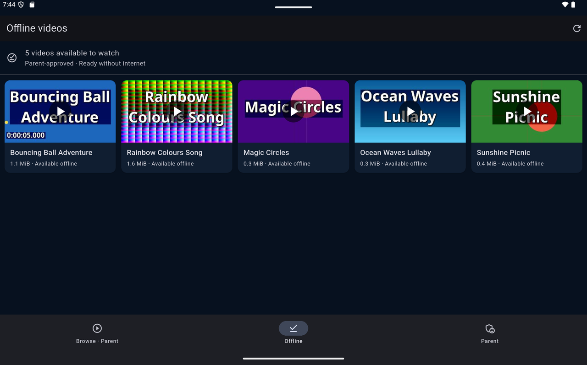
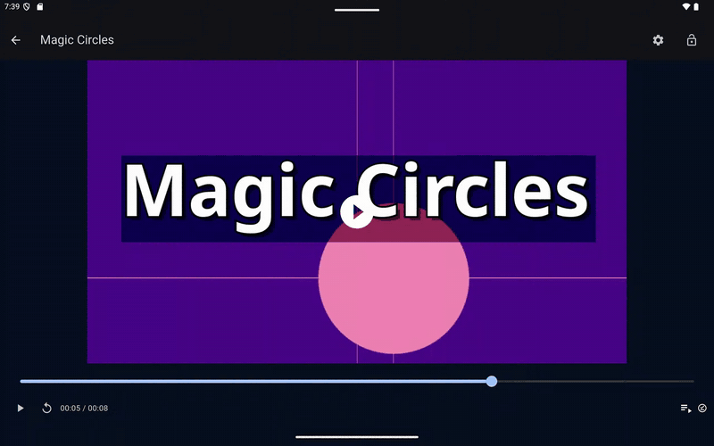
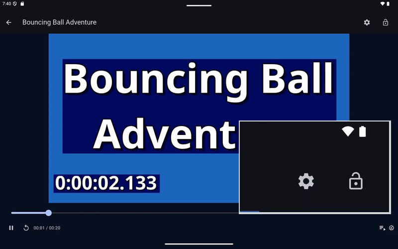
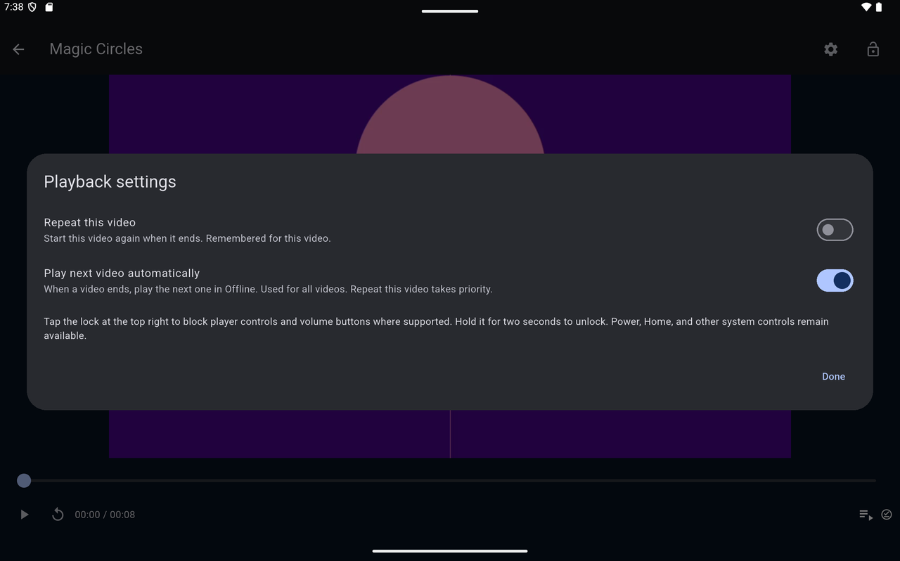
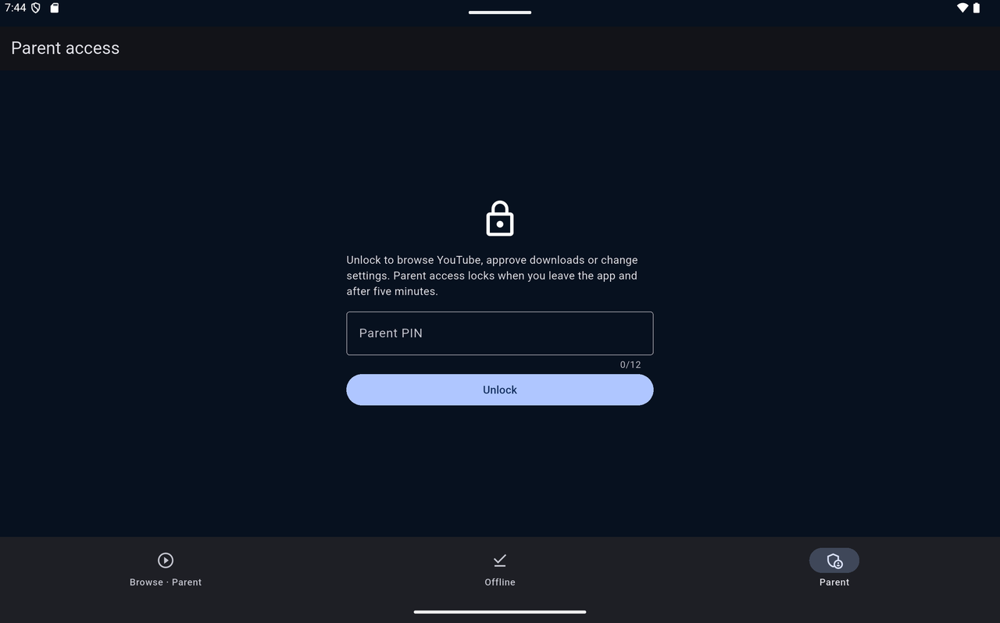
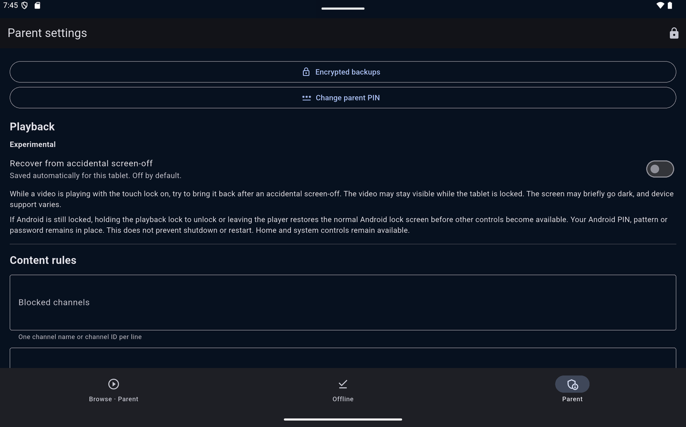
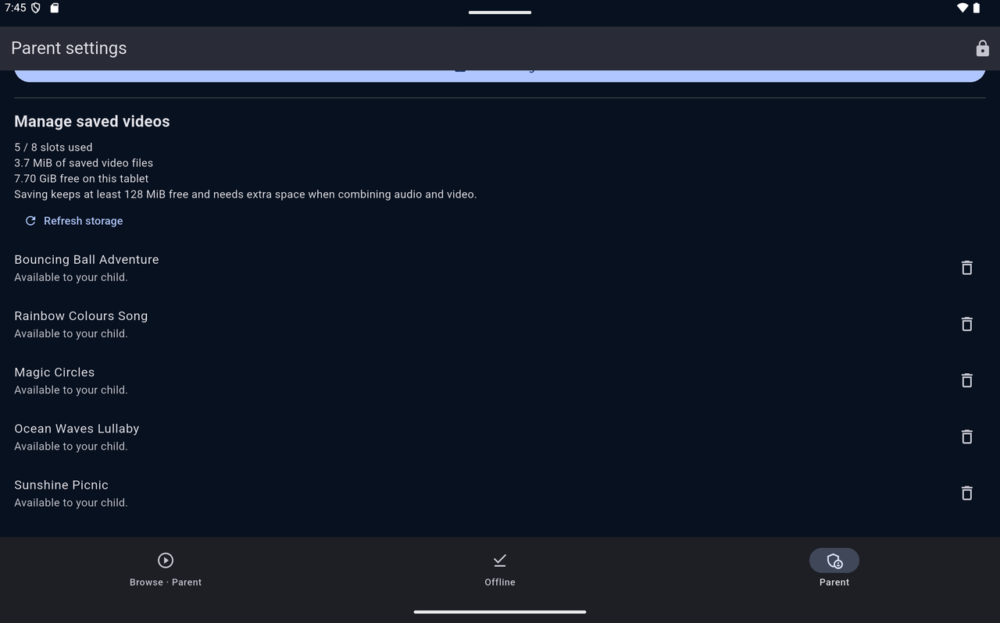

# MITS Kids

A parent-curated, offline YouTube player for Android tablets, built with Flutter.

<p align="center">
  
</p>

A parent browses YouTube behind a PIN, approves individual videos and saves them
to the tablet. Children see only that approved offline library, with no live
YouTube browsing, and watch it in a player designed to resist stray taps.

> **Not affiliated with YouTube or Google.** Downloads use the unofficial
> [`youtube_explode_dart`](https://pub.dev/packages/youtube_explode_dart)
> extractor, so availability can change at any time. Private, paid,
> age-restricted, live and encrypted content is unsupported. Only save videos
> you are permitted to download.

## See it in action

Recorded on an Android 15 tablet emulator, using generated demo videos.

**Autoplay.** When a video ends, the next one in Offline starts by itself, and
the touch lock stays on throughout.



**Touch lock.** Tap the lock and the video keeps playing while taps and swipes
are ignored. Hold the lock for two seconds to unlock; the inset magnifies it.



**Scene previews.** Dragging the timeline shows frames from the saved file, and
releasing jumps there. The capture is cropped around the timeline.


**Playback settings.** Repeat is remembered for each video; autoplay is one
choice for all of them.



**Parent tools.** Browse, which shows YouTube's own site and is not pictured
here, and Parent are behind a PIN.

<table>
  <tr>
    <td></td>
    <td></td>
    <td></td>
  </tr>
  <tr>
    <td>Parent access needs the 6–12 digit PIN.</td>
    <td>Backups, PIN change, playback options and content rules.</td>
    <td>Saved videos, slots and free storage, with deliberate deletion.</td>
  </tr>
</table>

## Features

**For children: the Offline tab**

- Up to eight parent-approved videos, shown as picture cards. Each picture is a
  frame from the saved video, made on the tablet without network access.
- Playback works without internet. The current content rules and the file's
  SHA-256 digest are checked before a video opens.
- A touch lock: tap the lock to block taps, drags, seeking and Back, then hold
  it for two seconds to unlock. Volume keys are ignored while locked, and the
  system bars are hidden where Android allows.
- Scene previews while dragging the timeline, made from the local file.
- **Repeat this video**, remembered per video, and **Play next video
  automatically**, one choice for all videos. Repeat takes priority.

**For parents: behind a 6–12 digit PIN**

- Anonymous, parent-only YouTube browsing. **Approve & save** confirms each
  video's title and channel before it downloads, at up to 720p and 1 GiB.
- An approved save can finish in the background for up to 30 minutes, with
  progress and Cancel in Offline and an Android notification.
- Content rules for blocked channels and title keywords. They apply to saved
  videos as well as new ones.
- A storage summary, deliberate deletion, PIN change, and password-protected
  backup and restore.
- **Recover from accidental screen-off**: an experimental option, off by
  default, for a locked video that is playing when the screen turns off.

## Security model in brief

- The PIN verifier uses PBKDF2-HMAC-SHA256 with an Android Keystore key.
  Repeated wrong PINs trigger cooldowns that survive restarts. Parent access
  ends after five minutes, on switching to Offline, or when the app is left.
- Saved videos record their approval, channel and content digest. Cleartext
  traffic is disabled, the downloader only contacts YouTube hosts, Android cloud
  backups are disabled, and screens use `FLAG_SECURE`.
- This is an app-level parental gate, not device management. There is no kiosk
  mode, device administration or launcher replacement, and this is a deliberate
  choice ([docs/ROADMAP.md](docs/ROADMAP.md)). Android Settings, uninstalling,
  Power and Home stay under Android's control, and setup assumes the parent
  controls the device.

More detail: [security review](docs/SECURITY-REVIEW.md),
[offline library](docs/OFFLINE.md), [encrypted backups](docs/ENCRYPTED-BACKUP.md),
[APK permission policy](docs/APK-POLICY.md).

## Requirements

- Android 8.0 (API 26) or newer.
- Flutter stable, last built with 3.47, plus the Android SDK and JDK 17 or newer.
- `flutter_inappwebview` is pinned to 6.2.0-beta.3 for an Android Gradle Plugin 9
  compatibility fix; see [docs/ROADMAP.md](docs/ROADMAP.md).

## Build and test

```bash
flutter pub get
flutter analyze
flutter test
flutter run    # debug build on a connected device or emulator
```

`tools/test_android.sh emulator-5554` runs the native acceptance tests on a local
emulator. They run in a separate `.validation` installation, so they never touch
a real install's PIN or videos.

Release builds need your own signing key and deliberately fail without one. See
[docs/SECURITY-UPDATE.md](docs/SECURITY-UPDATE.md) and
[docs/RELEASE-EVIDENCE.md](docs/RELEASE-EVIDENCE.md). The application ID is still
`com.example.mits_kids_youtube`; choose your own before distributing a build.

## Project layout

| Path | Contents |
| --- | --- |
| `lib/` | Flutter app: screens, services and widgets |
| `android/` | Android host and native plugins: Keystore PIN, muxing, backups, playback lock, screen-off recovery, scene previews |
| `test/`, `integration_test/` | Unit and widget tests; on-device acceptance tests |
| `tools/` | Release, APK policy, dependency audit and native check scripts |
| `docs/` | Design, security and validation notes, including the testing history |

## Status

A personal project shared as-is, currently at version 0.4.8. It may receive
occasional updates, but there is no support commitment.
[docs/VALIDATION.md](docs/VALIDATION.md) records what was and was not tested.

## License

[MIT](LICENSE). The video test fixture is derived from a Flutter sample and keeps
its BSD-3-Clause notice in [integration_test/fixtures](integration_test/fixtures/).
